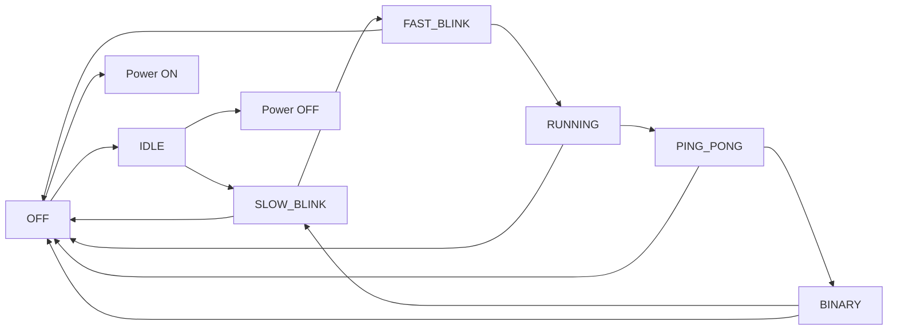

# multimode-led-controller-fsm
Multi-mode LED controller based on FSM with non-blocking timing, debounce, and EEPROM persistence.


## Multi-Mode LED Controller Based on FSM

### Overview

This project implements a multi-mode LED controller using Arduino.

The system demonstrates fundamental embedded systems concepts including:
- Finite State Machine (FSM)
- Non-blocking timing using millis()
- Hardware and software debounce
- Internal pull-up resistors
- Event-driven button handling
- EEPROM state persistence

## Features

- Power ON/OFF control
- Mode switching via button
- 6 different LED patterns:
 - All OFF
 - Slow blink (1s)
 - Fast blink (200ms)
 - Running light
 - Ping-pong effect
 - Binary counter
- System state saved in EEPROM
- Resume last state after power reset
- Full system reset when both buttons are pressed


## Hardware Components

- Arduino Uno (or compatible)
- 6 LEDs
- 6 × 220Ω resistors
- 2 push buttons
- 2 × 100nF capacitors (hardware debounce)
- Internal pull-up resistors (INPUT_PULLUP)


## Pin Configuration

|Function|	 |Pin|
|------|---|----|
|LED1–LED6|	|D2–D7|
|Mode Button|	|D8|
|Power Button|	|D9|

Buttons are connected using Active LOW configuration.


## System Architecture

The system is designed as a Finite State Machine (FSM):
- State = Mode (0–5)
- System Enable = Power state
- Event-driven transitions via button edges
- Non-blocking timing for responsive input handling


## Timing Intervals

|Mode|	|Interval|
|-----|----|-----|
|Slow Blink|	|1000 ms|
|Fast Blink|	|200 ms|
|Running|	|150 ms|
|Ping-Pong|	|120 ms|
|Binary|	|250 ms|


## EEPROM Persistence

The following parameters are stored:
- Current mode
- Power state
- Running index
- Direction
- Binary counter

The system resumes from the last state after power cycle.


## Demonstration Video


## FSM Diagram



## Learning Objectives

This project demonstrates:
- Embedded state machine design
- Event-driven programming
- Hardware and software debounce techniques
- Non-blocking architecture
- Persistent system state management
- Multi-mode output control


## Snippet Code

```cp
// Pin definitions
const byte ledPins[6] = {2, 3, 4, 5, 6, 7};
const byte modeButtonPin = 8;
const byte powerButtonPin = 9;

// Main loop
void loop() {
  readButtons();

  if (systemOn) {
    switch(mode) {
      case 0: turnAllOff(); break;
      case 1: blinkAll(); break;
      case 2: runningLight(); break;
      // ...
    }
  }
}
```
